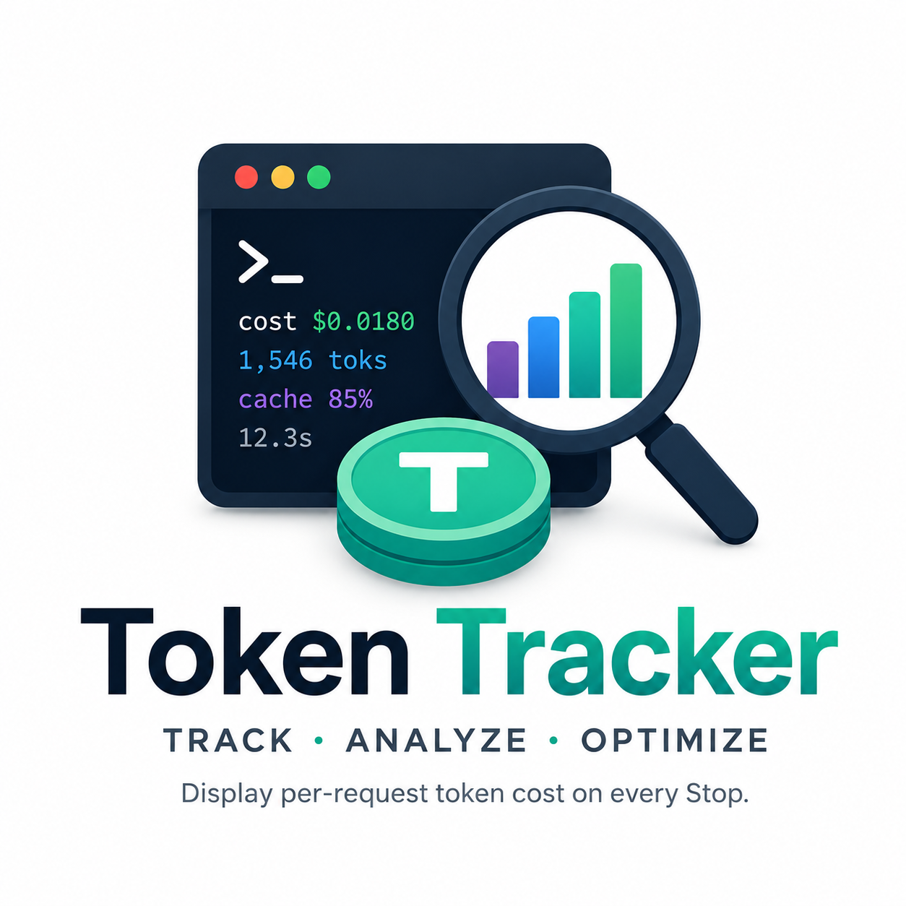

<p align="center">
  
</p>

<p align="center">
  <strong>English</strong> · <a href="README.ko.md">한국어</a>
</p>

# Token Tracker

Claude Code plugin that displays per-request token cost on every `Stop`.

## What it shows

After every assistant response, a one-line summary appears below it:

```
cost $0.0180 · 1,546 toks · cache 85% · 12.3s
```

- **cost**: retail pay-per-token cost estimate for just this request.
- **toks**: total (input + output + cache_read) tokens consumed.
- **cache**: `cache_read / total_input` hit rate.
- **s**: wall-clock seconds from `UserPromptSubmit` to `Stop`.

## Detail view — two ways

### Option 1 (recommended): verbose mode — auto-printed every response

Set `"verbose": true` in `plugins/token-tracker/config.json` and the Stop hook will print the one-line summary plus a per-turn detail table at the end of every response:

```json
{
  "language": "en",
  "verbose": true
}
```

For one-off debugging, the env var is handier:

```bash
export TOKEN_TRACKER_VERBOSE=1
```

This path emits via `systemMessage` directly from the hook, so it's **deterministic (no LLM in the loop) and costs zero tokens**.

### Option 2 (on-demand): `/token-detail` slash skill

Inspect the most recent request's per-turn breakdown when you want it:

```
/token-detail
```

Example output:

```
━━━━━━━━━━━━━━━━━━━━━━━━━━━━━━━━━━━━━━━━━━━━━━━━━━━━━━━━━━━━━━━━━━━━━━━━━━━━━
 Last request detail
 total $0.0180 | 1,546 toks | cache 85% | 12.3s

   #  model                   tools              input    cc       cr    output     cost      time
   1  opus-4-7[1m]            Read×3,Edit×1      120     400      800       450    $0.008     2.1s
   2  opus-4-7[1m]            —                   95       0    1,200       320    $0.006     3.5s
━━━━━━━━━━━━━━━━━━━━━━━━━━━━━━━━━━━━━━━━━━━━━━━━━━━━━━━━━━━━━━━━━━━━━━━━━━━━━
 Legend: cc=cache_creation, cr=cache_read
```

The skill is registered with `disable-model-invocation: true`, so Claude won't auto-call it — the user must type `/token-detail` explicitly. It's just a script + minimal SKILL.md, so each invocation costs only a few hundred tokens.

> **Note**: slash skills always go through the LLM in Claude Code, so the model can occasionally drift off into prose instead of returning the table. **For deterministic output, use Option 1 (verbose).**

## Cost is "retail" — it will not match the statusline

Claude Code's statusline `[💰 $X.XXX]` shows its **internal session-cumulative** cost tracker, which may reflect team/enterprise plan discounts or different cache-creation accounting. This plugin computes cost from Anthropic's **public pay-per-token rate card** (values hardcoded in `lib/pricing.py`).

Use this plugin's output as an **optimization signal** (did caching improve? is this prompt expensive relative to the last one?), not for billing.

## Install

This repo is itself a self-contained Claude Code marketplace (`token-keeper`). Register it once with Claude Code and the hook fires regardless of which directory you run Claude Code from.

```bash
# Option A — register from GitHub (recommended)
/plugin marketplace add token-keeper/token-tracker

# Option B — point at a local clone (for development / offline use)
/plugin marketplace add /absolute/path/to/token-tracker

# Activate the plugin
/plugin install token-tracker@token-keeper
```

After activation, restart Claude Code. The Stop hook will then print a line like the one above after every response.

Disable: `/plugin disable token-tracker@token-keeper`
Uninstall: `/plugin uninstall token-tracker@token-keeper`

### Dev mode

To pick up code changes from this repo without reinstalling on every edit, use the [`scripts/dev-mode.sh`](#development) toggle described in the Development section below.

The older approach of registering the hook directly in `.claude/settings.local.json` is no longer used.

## Files of interest

- `docs/superpowers/specs/` — design specs (Phase 1 overall + Phase 2-B `/token-detail`)
- `docs/superpowers/plans/` — per-phase implementation plans
- `docs/handoff/` — cross-session handoff notes
- `plugins/token-tracker/lib/pricing_data.json` — rate-card table (when Anthropic prices change, edit only the rows here and bump `fetched`)
- `plugins/token-tracker/lib/pricing.py` — JSON loader + cost computation (`compute_cost`, prefix-match resolver)
- `plugins/token-tracker/hooks/on_stop.py` — aggregation + output
- `plugins/token-tracker/lib/i18n/` — translated strings for ko/en

## Development

### Dev mode (working dir ↔ cache instant reflection)

When you're editing plugin code and don't want to reinstall on every change, use the dev-mode toggle:

```bash
./scripts/dev-mode.sh on      # cache → symlink to working dir
./scripts/dev-mode.sh off     # restore the original cache
./scripts/dev-mode.sh status  # show current state
```

`on` backs the cache directory up to `<version>.backup/` and replaces it with a symlink that points at this repo's `plugins/token-tracker/`. `off` reverses the swap.

#### When you edit daemon code

Editing `lib/server_daemon.py`, `lib/http_server.py`, `lib/history_renderer.py`, or any other long-running daemon code requires restarting the daemon:

```
/token-tracker:token-history-stop
```

Static files like `style.css` / `app.js` / templates are read from disk on every request, so a browser reload (cmd+R) is enough.

#### Interaction with `/plugin uninstall` + `/plugin install`

If you `uninstall` and `install` while dev mode is on, the plugin system rebuilds the cache directory and the symlink disappears. `./scripts/dev-mode.sh status` detects this state and tells you what happened. The script does not auto-recover because it can't decide which side is the source of truth — it just prints the manual command to run.

#### Manual smoke-check

When you're spinning up dev mode in a fresh environment or after a Claude Code update:

1. `./scripts/dev-mode.sh status` → expect "OFF"
2. `./scripts/dev-mode.sh on` → expect "ON" + the symlink target path
3. Run `/reload-plugins`
4. Submit a new prompt → expect a token line (`cost $... · ... toks ...`) at the end of the response
5. Run `/token-tracker:token-history` → expect the daemon to come up and print a URL
6. Edit a CSS line in `plugins/token-tracker/skills/token-history/static/style.css` → reload the page, expect immediate effect (a `#FF0000` marker is great for verification)
7. `./scripts/dev-mode.sh off` → expect "OFF" again, `<version>.backup/` gone

If steps 3–5 fail, the plugin system isn't honoring the symlink. Toggle `off` immediately and file an issue.

## Tests

From the repo root:

```bash
./venv/bin/pytest plugins/token-tracker/tests -q
```

80 tests across unit + integration + e2e (hook subprocess, skill script subprocess). Python 3.10+ stdlib only, pytest as the only dev dependency.
